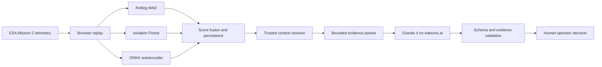

# FlightSentry

**AI incident response for spacecraft telemetry.** FlightSentry detects unusual spacecraft behavior, assembles trusted operational context, and gives a human operator an evidence-linked investigation brief.

> Challenge theme: **Advance Space Exploration with AI — IBM AI Builders Challenge, August 2026**

## Problem

Spacecraft operations teams monitor large, noisy telemetry streams where rare planned activities can resemble faults. A detector that raises an alarm without command and mission-plan context increases operator load; a language model allowed to improvise explanations creates a different risk.

The ESA Mission 2 benchmark documents a useful pair: event **609** is a commanded rare nominal event, while event **618** is a non-commanded anomaly with a similar telemetry change. FlightSentry turns that distinction into an operator workflow.

## Solution

1. Rolling median/MAD, Isolation Forest, and a rank-2 linear autoencoder score telemetry independently. The bundled browser model is linear and transparent; the source-data pipeline stages a nonlinear MLPRegressor 4-8-2-8-4 candidate for review.
2. A versioned weighted ensemble requires three of five windows above threshold; source candidates select weights through validation grid search.
3. Trusted telecommands and planned events are correlated with the alert timeline.
4. Granite 4 receives only a server-created evidence packet and returns a validated incident brief.
5. A human operator reviews observations, uncertainty, and diagnostic checks. FlightSentry never executes spacecraft commands.

The public demo contains a deterministic paired-case fixture modeled on ESA events 609 and 618 so it works without downloading raw mission data. It is clearly labeled and is **not** presented as an official ESA-ADB evaluation. The included pipeline downloads and verifies the source archive, publishes two attributed extracts, and stages trained artifacts without replacing the proven browser model.

### Source-data checkpoint

The Mission 2 pipeline has now been run end to end. The checksum-verified extracts confirm that event 609 overlaps anonymized `telecommand_6` and `event_14`, while event 618 has neither record. The source-trained candidate detected both paired events, but did not outperform Rolling MAD on held-out event 618, so it remains staged. See the [source evaluation](docs/source-evaluation.md) and the Technical Proof view for exact metrics.

## Architecture



See [architecture.md](docs/architecture.md) for boundaries and failure behavior.

## Stack

- Next.js 16 App Router, React 19, TypeScript, Tailwind CSS 4
- uPlot telemetry charts and ONNX Runtime Web
- Vitest, Testing Library, Playwright, and axe-core
- Python, pandas, scikit-learn, skl2onnx, and ONNX Runtime
- Granite 4 through the watsonx.ai chat endpoint
- Vercel Fluid Compute using the default Node.js runtime

## Run locally

Requirements: Node.js 22+ and Python 3.11+.

```powershell
npm install
Copy-Item .env.example .env.local
npm run dev
```

Open `http://127.0.0.1:3000`. Without watsonx credentials, the app intentionally uses validated reference briefs and displays a reference-mode banner.

For live Granite analysis, set these server-only values in `.env.local`:

```dotenv
GRANITE_LIVE_ENABLED=true
WATSONX_API_KEY=your-key
WATSONX_PROJECT_ID=your-project-id
WATSONX_URL=https://us-south.ml.cloud.ibm.com
WATSONX_MODEL_ID=ibm/granite-4-h-small
```

Do not prefix secrets with `NEXT_PUBLIC_`.

## Verify

```powershell
npm run verify
npx playwright install chromium
npm run test:e2e
.\.venv\Scripts\python.exe -m unittest discover scripts\data_pipeline\tests
```

## Reproduce the ESA data and model path

Raw archives and training artifacts are Git-ignored. Mission 2 is approximately 4.1 GB compressed.

```powershell
python -m venv .venv
.\.venv\Scripts\python.exe -m pip install -r requirements-ml.txt
.\.venv\Scripts\python.exe -m scripts.data_pipeline.download_esa_mission2 --extract --workers 8
.\.venv\Scripts\python.exe -m scripts.data_pipeline.extract_scenarios data\raw\ESA-Mission2 --publish-dir public\data\source-evaluation
.\.venv\Scripts\python.exe -m scripts.data_pipeline.train_ensemble
```

The downloader verifies the ESA-published MD5 `0b7505b7f0731ca037ee889ca2a520ce`, rejects archive path traversal, and resumes parallel byte ranges. Training defaults to ignored staging under `artifacts/training/source-v1`. Writing a candidate under `public/` requires the explicit `--promote-web` flag after parity and evaluation review.

## Deploy to Vercel

Production is available at [flightsentry.vercel.app](https://flightsentry.vercel.app). Install the Vercel CLI to enable environment pulls, deployments, and log inspection.

```powershell
npm i -g vercel
vercel link
vercel env pull .env.local
vercel deploy
vercel logs
```

Add watsonx values with `vercel env add`; never commit them. `GRANITE_LIVE_ENABLED=false` is a safe public-demo fallback.

## IBM Bob usage

The challenge requires IBM Bob as the primary development tool. This repository includes an honest [IBM Bob build log](docs/ibm-bob-build-log.md) and prompt plan. The current scaffold was produced in Codex, so **do not claim Bob compliance yet**. Recreate or materially iterate the implementation in Bob, capture its changes and screenshots, and complete the log before submission.

## Submission assets

- [Three-minute video script](docs/video-script.md)
- [Data card](docs/data-card.md)
- [Model card](docs/model-card.md)
- [Source-data evaluation](docs/source-evaluation.md)
- [IBM Bob build log](docs/ibm-bob-build-log.md)
- [Validation record](docs/validation.md)

## Data attribution

The source pipeline targets the **ESA Anomaly Dataset**, published by the European Space Agency under **CC BY 3.0 IGO**: [Zenodo record 12528696](https://zenodo.org/records/12528696). The paired-case interpretation is documented in the [ESA benchmark paper](https://openreview.net/pdf?id=bbpRMoatVO).

FlightSentry results are project-level demonstrations and must not be described as official ESA-ADB leaderboard results.
