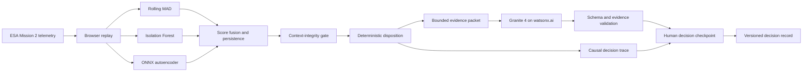

# FlightSentry

**AI incident response for spacecraft telemetry.** FlightSentry detects unusual spacecraft behavior, assembles trusted operational context, and gives a human operator an evidence-linked investigation brief.

> Challenge theme: **Advance Space Exploration with AI (IBM AI Builders Challenge, August 2026)**

## Problem

Spacecraft operations teams monitor large, noisy telemetry streams where rare planned activities can resemble faults. A detector that raises an alarm without command and mission-plan context increases operator load; a language model allowed to improvise explanations creates a different risk.

The ESA Mission 2 benchmark documents a useful pair: event **609** is a commanded rare nominal event, while event **618** is a non-commanded anomaly with a similar telemetry change. FlightSentry turns that distinction into an operator workflow.

## Solution

1. Rolling median/MAD, Isolation Forest, and a rank-2 linear autoencoder score telemetry independently. The bundled browser model is linear and transparent; the source-data pipeline stages a nonlinear MLPRegressor 4-8-2-8-4 candidate for review.
2. A versioned weighted ensemble requires three of five windows above threshold; source candidates select weights through validation grid search.
3. Trusted telecommands and planned events are correlated with the alert timeline.
4. A deterministic context-integrity gate verifies timing, record pairing, and replay-feed completeness before `MONITOR` is allowed.
5. Operators can compare telemetry-only and trusted-context decisions, then remove evidence to prove the result changes for the right reason.
6. Granite 4 receives only a server-created evidence packet and returns a validated incident brief. The interface labels every brief with its provenance: live watsonx model id or the validated stored reference.
7. An inspectable replay timeline lets operators pause, scrub, step, and jump directly to event onset or the first persistent alert without changing detector output.
8. A live causal decision trace quantifies paired signal-shape correlation, then exposes detector agreement, active command and plan evidence, gate status, and disposition in one recalculating path.
9. A subsystem impact map calculates the signed peak excursion, peak time, and end-of-replay recovery for every power, attitude-control, and thermal channel without inventing a severity score.
10. An interactive investigation runbook turns Granite's diagnostic checks into accountable operator work. Pending checks block signoff; a documented concern raises a `MONITOR` recommendation to at least `INVESTIGATE`.
11. A human operator accepts the recommendation or raises severity, records a rationale, and exports the finalized checkpoint, runbook, and impact analysis in JSON or printable HTML. FlightSentry never executes spacecraft commands.

Server hardening for the public demo: a strict Content-Security-Policy and standard security headers ship from `next.config.ts`, the analysis endpoint rate-limits per client, successful live briefs are cached server-side for five minutes so replay reruns do not re-bill watsonx, and an ambiguous or gate-failing model disposition always resolves to `INVESTIGATE`.

The public demo contains a deterministic paired-case fixture modeled on ESA events 609 and 618 so it works without downloading raw mission data. It is clearly labeled and is **not** presented as an official ESA-ADB evaluation. The included pipeline downloads and verifies the source archive, publishes two attributed extracts, and stages trained artifacts without replacing the proven browser model.

### Source-data checkpoint

The Mission 2 pipeline has now been run end to end. The checksum-verified extracts confirm that event 609 overlaps anonymized `telecommand_6` and `event_14`, while event 618 has neither record. The source-trained candidate detected both paired events, but did not outperform Rolling MAD on held-out event 618, so it remains staged. See the [source evaluation](docs/source-evaluation.md) and the Technical Proof view for exact metrics.

### Operational differential

The paired-case context policy makes FlightSentry's role measurable:

| Mode | Event 609 | Event 618 |
| --- | --- | --- |
| Telemetry only | `INVESTIGATE` | `INVESTIGATE` |
| Trusted context | `MONITOR` | `INVESTIGATE` |

On this intentionally narrow `n=2` challenge replay, trusted context prevents one unnecessary investigation, preserves 100% anomaly investigation recall, and passes a 2-of-2 counterfactual dependency check. Removing either the command record or planned-event record from event 609 raises it back to `INVESTIGATE` without asking Granite. These are FlightSentry paired-case metrics, not official ESA-ADB results.

## Architecture



See [architecture.md](docs/architecture.md) for boundaries and failure behavior.

## Stack

- Next.js 16 App Router, React 19, TypeScript, Tailwind CSS 4
- Dependency-free SVG strip-chart telemetry and ONNX Runtime Web
- Vitest, Testing Library, Playwright, and axe-core
- Python, pandas, scikit-learn, skl2onnx, and ONNX Runtime
- Granite 4 through the watsonx.ai chat endpoint
- Vercel Fluid Compute using the default Node.js runtime

## Run locally

Requirements: Node.js 22+ and Python 3.11+.

```powershell
npm install
Copy-Item .env.example .env.local
npm run dev
```

Open `http://localhost:3000`. Without watsonx credentials, the app intentionally uses validated reference briefs and displays a reference-mode banner.

For live Granite analysis, set these server-only values in `.env.local`:

```dotenv
GRANITE_LIVE_ENABLED=true
WATSONX_API_KEY=your-key
WATSONX_PROJECT_ID=your-project-id
WATSONX_URL=https://us-south.ml.cloud.ibm.com
WATSONX_MODEL_ID=ibm/granite-4-h-small
```

Do not prefix secrets with `NEXT_PUBLIC_`.

## Verify

```powershell
npm run verify
npx playwright install chromium
npm run test:e2e
uv run --with-requirements requirements-ml.txt python -m unittest discover scripts\data_pipeline\tests
```

Playwright runs desktop and mobile Chromium projects, including an axe-core
sweep across the idle, completed, telemetry-only, counterfactual, and
Technical Proof states. The Python suite needs the ML requirements; `uv run`
is the recorded validation path (a bare venv without `pandas`/`onnx` fails).

## Reproduce the ESA data and model path

Raw archives and training artifacts are Git-ignored. Mission 2 is approximately 4.1 GB compressed.

```powershell
python -m venv .venv
.\.venv\Scripts\python.exe -m pip install -r requirements-ml.txt
.\.venv\Scripts\python.exe -m scripts.data_pipeline.download_esa_mission2 --extract --workers 8
.\.venv\Scripts\python.exe -m scripts.data_pipeline.extract_scenarios data\raw\ESA-Mission2 --publish-dir public\data\source-evaluation
.\.venv\Scripts\python.exe -m scripts.data_pipeline.train_ensemble
```

The downloader verifies the ESA-published MD5 `0b7505b7f0731ca037ee889ca2a520ce`, rejects archive path traversal, and resumes parallel byte ranges. Training defaults to ignored staging under `artifacts/training/source-v1`. Writing a candidate under `public/` requires the explicit `--promote-web` flag after parity and evaluation review.

## Deploy to Vercel

Production is available at [flightsentry.vercel.app](https://flightsentry.vercel.app). Install the Vercel CLI to enable environment pulls, deployments, and log inspection.

```powershell
npm i -g vercel
vercel link
vercel env pull .env.local
vercel deploy
vercel logs
```

Add watsonx values with `vercel env add`; never commit them. `GRANITE_LIVE_ENABLED=false` is a safe public-demo fallback.

## IBM Bob usage

IBM Bob was the primary development tool across FlightSentry's planning, implementation, testing, and iteration. Bob was used to develop the detector configuration and parity checks, harden the Granite and API boundaries, build the paired replay and operator workflow, expand accessibility coverage, and validate the final integrated application. An independent cybersecurity review was performed after implementation, and substantiated findings were returned to the Bob-led development workflow for correction and regression testing.

The [IBM Bob build log](docs/ibm-bob-build-log.md) records representative prompts, files changed, test results, review corrections, and safety properties. The public challenge checklist does not require Bob screenshots, but authentic session captures can be included as optional supporting evidence.

## Submission assets

- [Three-minute video script](docs/video-script.md)
- [Data card](docs/data-card.md)
- [Model card](docs/model-card.md)
- [Source-data evaluation](docs/source-evaluation.md)
- [IBM Bob build log](docs/ibm-bob-build-log.md)
- [Submission evidence checklist](docs/submission-checklist.md)
- [Validation record](docs/validation.md)

## Data attribution

The source pipeline targets the **ESA Anomaly Dataset**, published by the European Space Agency under **CC BY 3.0 IGO**: [Zenodo record 12528696](https://zenodo.org/records/12528696). The paired-case interpretation is documented in the [ESA benchmark paper](https://openreview.net/pdf?id=bbpRMoatVO).

FlightSentry results are project-level demonstrations and must not be described as official ESA-ADB leaderboard results.
